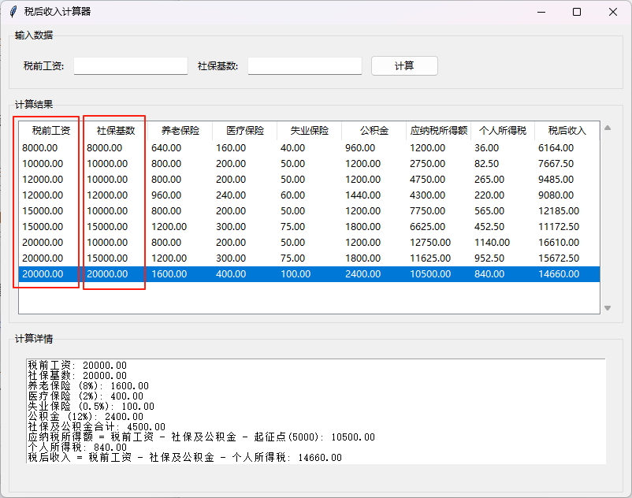
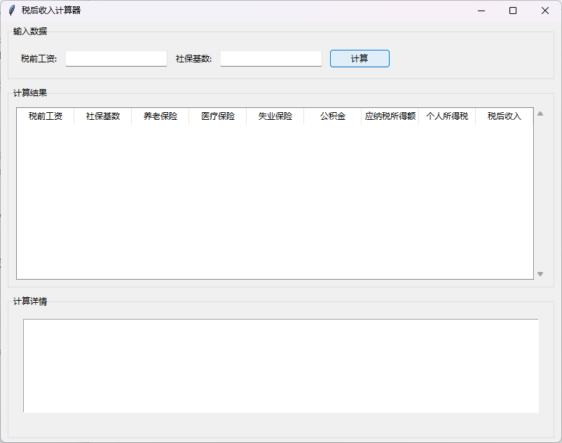
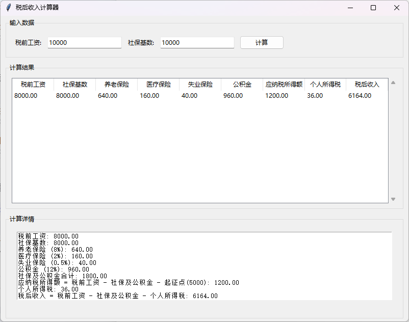
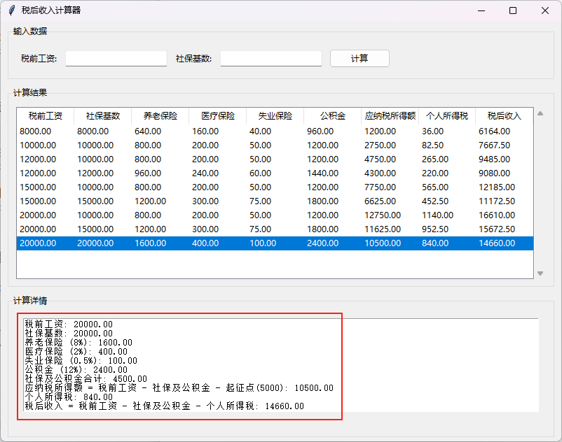

# 缘起 🚀

> 💡 **项目背景**
> 
> 最近呢，也是开始关注税这个事情，之前收入微薄，甚至都算不上纳税人。
> 
> 那我们也知道，税务的计算也是相当繁琐，网上搜了大半天也没找到合适的清晰的收入对比工具。
> 
> 因此呢，想着自己搞一个吧！
> 
> 那么我来啦！ 🎉



<details open>
    <summary>💭 梦开始的地方</summary>
    
    这是一个基于Python开发的税后收入计算器，帮助用户快速计算个人所得税和社保公积金扣除后的实际收入。
    项目采用模块化设计，包含计算核心、用户界面和数据存储三个主要模块。
    
    **✨ 核心特色：**
    - 🧮 精确的税务计算算法
    - 🖥️ 友好的图形用户界面
    - 💾 智能的数据管理功能
    - 📊 详细的计算过程展示
</details>

---

# 功能展示 🎯

## 主界面预览



## 操作演示

### 1️⃣ 输入数据
输入税前收入和社保基数，点击计算按钮



### 2️⃣ 查看详细计算过程
这里可以看到详细的计算过程哦！



---

# 计划 📋

## 整体规划 🎯

<details open>
    <summary>🧮 功能一：税后收入计算</summary>
    
    **核心功能模块，实现个人所得税和社保公积金的精确计算：**
    
    - ✅ 支持自定义社保基数
    - ✅ 计算养老保险(8%)、医疗保险(2%)、失业保险(0.5%)、公积金(12%)
    - ✅ 按照最新个税税率表计算个人所得税
    - ✅ 提供详细的计算步骤和公式说明
    - ✅ 实时计算结果显示
</details>

<details open>
    <summary>🖥️ 功能二：图形用户界面</summary>
    
    **基于Tkinter开发的现代化GUI界面：**
    
    - ✅ 简洁直观的输入界面
    - ✅ 表格形式展示计算结果
    - ✅ 详细的计算过程展示
    - ✅ 历史记录保存和加载功能
    - ✅ 响应式布局设计
</details>

<details open>
    <summary>💾 功能三：数据管理</summary>
    
    **本地数据存储和管理功能：**
    
    - ✅ JSON格式保存计算历史
    - ✅ 支持查看历史计算结果
    - ✅ 数据持久化存储
    - ✅ 计算步骤详细记录
    - ✅ 自动数据备份
</details>

---

# 项目结构 📁

## 代码路径

```
cctax/
├── cctax.py              # 🚀 主程序入口
├── cctax_calc.py         # 🧮 计算核心模块
├── cctax_ui.py           # 🖥️ 用户界面模块
├── cctax_database.json   # 💾 数据存储文件
├── requirements.txt      # 📦 依赖包列表
└── readme.md            # 📖 项目文档
```

## 代码仓库 🔗

| 项目信息 | 详情 |
|---------|------|
| **项目地址** | flechazo.mba |
| **作者** | CarlChai LinFeng Chai flechazo |
| **版本** | v1.0 |
| **开发语言** | Python 3.x |
| **界面框架** | Tkinter |
| **数据格式** | JSON |

---

# 使用方法 📖

## 快速开始 🚀

### 1️⃣ 安装依赖 📦

```bash
pip install -r requirements.txt
```

### 2️⃣ 运行程序 ▶️

```bash
python cctax.py
```

### 3️⃣ 操作说明 📝

| 步骤 | 操作 | 说明 |
|------|------|------|
| **1** | 📊 输入数据 | 在"输入数据"区域输入税前工资和社保基数 |
| **2** | 🧮 计算 | 点击"计算"按钮进行税后收入计算 |
| **3** | 📋 查看结果 | 在"计算结果"表格中查看计算结果 |
| **4** | 🔍 查看详情 | 点击表格中的任意行查看详细计算过程 |
| **5** | 💾 历史记录 | 程序会自动保存计算历史，重启后仍可查看 |

---

# 技术特性 ⚙️

## 计算规则 🧮

| 项目 | 比例 | 说明 |
|------|------|------|
| **💰 社保基数** | 自定义 | 可自定义设置，影响各项社保费用计算 |
| **🏥 养老保险** | 8% | 基数的8% |
| **💊 医疗保险** | 2% | 基数的2% |
| **🛡️ 失业保险** | 0.5% | 基数的0.5% |
| **🏠 公积金** | 12% | 基数的12% |
| **📊 个税起征点** | 5000元 | 个人所得税起征点 |
| **📈 个税税率** | 分级计算 | 按照最新个人所得税税率表计算 |

## 税率表 📊

| 应纳税所得额 | 税率 | 速算扣除数 | 示例 |
|-------------|------|-----------|------|
| ≤3000元     | 3%   | 0         | 3000×3% = 90元 |
| ≤12000元    | 10%  | 210       | 12000×10% - 210 = 990元 |
| ≤25000元    | 20%  | 1410      | 25000×20% - 1410 = 3590元 |
| ≤35000元    | 25%  | 2660      | 35000×25% - 2660 = 6090元 |
| ≤55000元    | 30%  | 4410      | 55000×30% - 4410 = 12090元 |
| ≤80000元    | 35%  | 7160      | 80000×35% - 7160 = 20840元 |
| >80000元    | 45%  | 15160     | 100000×45% - 15160 = 29840元 |

---

# 任务列表 📋

<details open>
    <summary>🚀 基础功能开发<progress value="100" max="100"></progress></summary>
    
    **✅ 已完成功能：**
    - ✅ 完成税后收入计算核心算法
    - ✅ 完成图形用户界面开发
    - ✅ 完成数据存储功能
    - ✅ 完成历史记录管理
    - ✅ 完成计算精度优化
</details>

<details open>
    <summary>⚡ 功能优化<progress value="80" max="100"></progress></summary>
    
    **✅ 已完成：**
    - ✅ 优化计算精度和性能
    - ✅ 改进用户界面布局
    - ✅ 添加错误处理机制
    
    **⏳ 进行中：**
    - ⏳ 添加数据导出功能
    - ⏳ 支持批量计算功能
</details>

<details open>
    <summary>🔮 扩展功能<progress value="30" max="100"></progress></summary>
    
    **⏳ 计划功能：**
    - ⏳ 支持不同城市的社保政策
    - ⏳ 添加年终奖计算功能
    - ⏳ 支持多种收入类型计算
    - ⏳ 添加图表分析功能
    - ⏳ 支持多语言界面
</details>

---

# 更新日志 📝

## v1.0 (2025-06-20) 🎉

**🚀 初始版本发布**

- 🧮 实现基础税后收入计算功能
- 🖥️ 完成图形用户界面
- 💾 添加数据持久化存储
- 📊 支持详细计算过程展示
- 🔧 优化用户交互体验

---

# 贡献指南 🤝

> 💡 **欢迎贡献**
> 
> 我们欢迎所有形式的贡献，包括但不限于：
> - 🐛 Bug报告
> - 💡 功能建议
> - 📝 文档改进
> - 🔧 代码优化
> - 🌍 多语言支持

**提交方式：**
- 提交Issue：报告问题或建议新功能
- 提交Pull Request：贡献代码改进

---

# 许可证 📄

```
Copyright (c) 2024-2025 by flechazo. All rights reserved.
```

---

<div align="center">

**🌟 如果这个项目对你有帮助，请给个Star支持一下！ 🌟**

</div>
